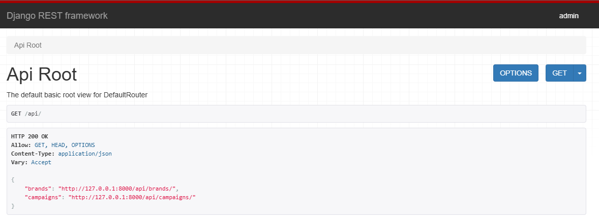
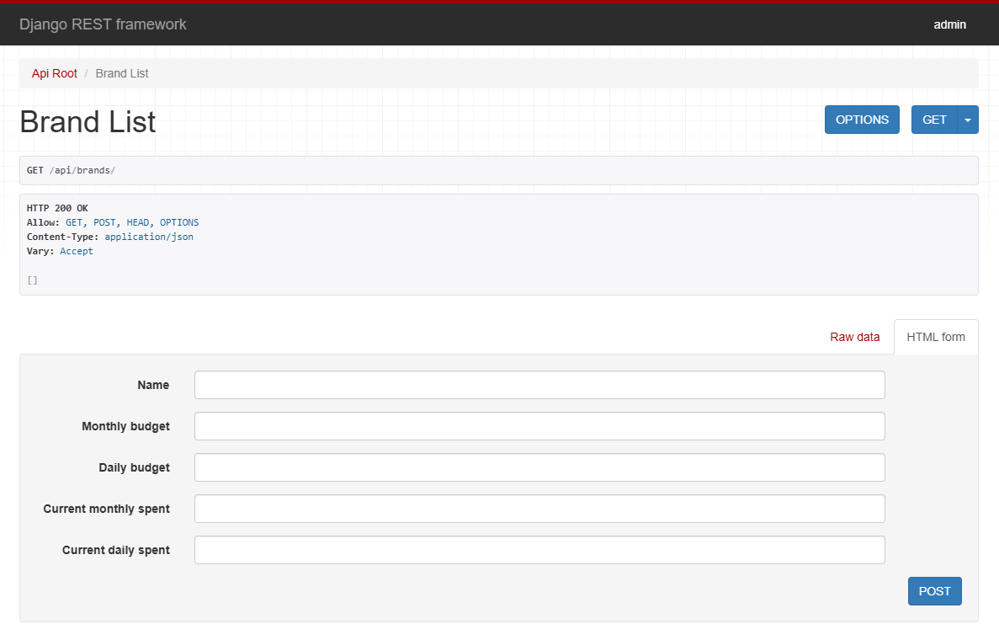
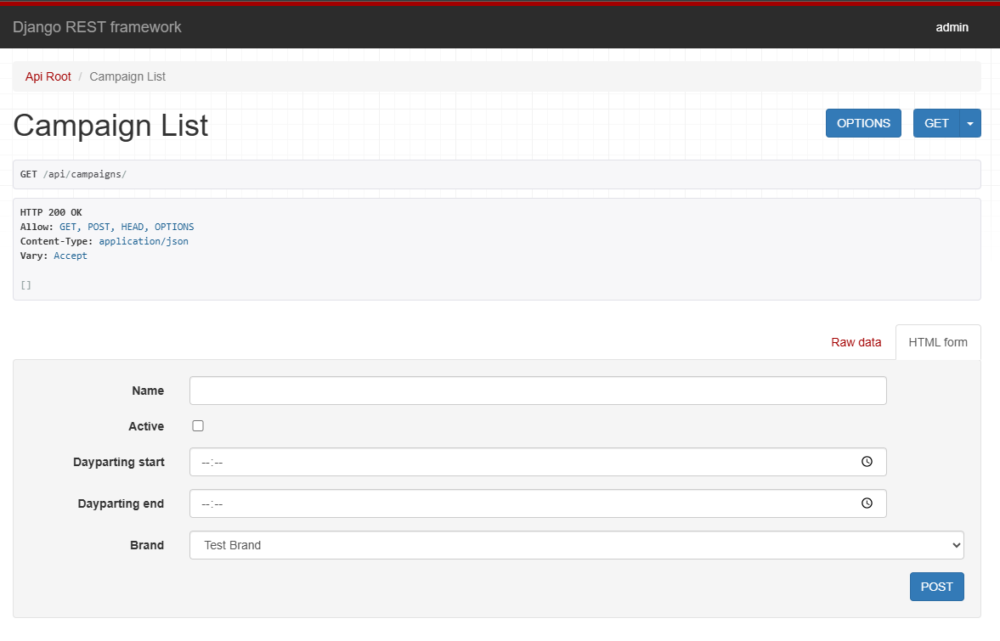
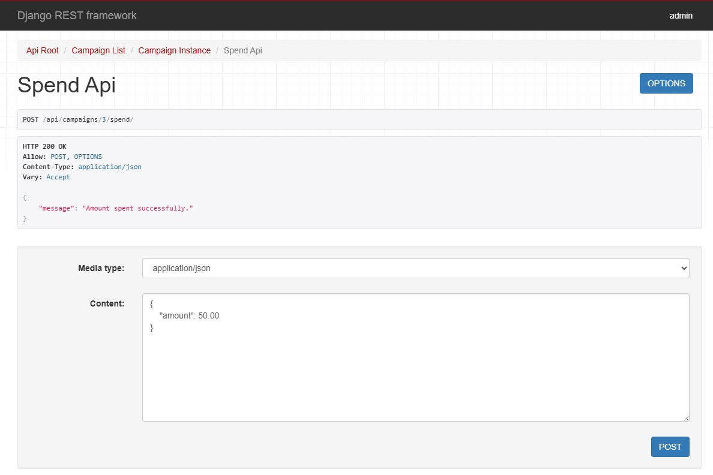

# My Ad Agency App

This is a Django web application with Celery integrated for asynchronous task management. The project includes periodic tasks using Celery Beat and results stored in the Django database.

## Features

- Django 5.x based web application
- Asynchronous task processing with Celery
- Periodic task scheduling using Celery Beat
- Django REST Framework integration for APIs
- Celery tasks results stored in the Django database via `django-celery-results`

## Installation

1. Clone this repository:

   ```bash
   git clone git@github.com:bmartins95/MyAdAgency.git
   cd MyAdAgency

   ```

2. Set up a virtual environment (optional but recommended):

   2.1 MacOS or Linux:

   ```bash
   python -m venv venv
   source venv/bin/activate
   ```

   2.2 Windows:

   ```bash
   python -m venv venv
   venv\Scripts\activate
   ```

3. Install the required dependencies:

   ```bash
   pip install -r requirements.txt
   ```

4. Apply the database migrations:

   ```bash
   python manage.py migrate
   ```

5. Create a superuser (optional for accessing the Django admin interface):

   ```bash
   python manage.py createsuperuser
   ```

## Running the Application

### Running the Django Server:

To start the Django development server, run:

```bash
python manage.py runserver
```

Your app should now be running at `http://127.0.0.1:8000/`.

### Running Celery Worker:

To start the Celery worker, open a new terminal window and run:

```bash
celery -A app worker --loglevel=info
```

This will start the Celery worker and begin processing tasks.

### Running Celery Beat for Scheduled Tasks:

To start Celery Beat, which schedules periodic tasks, run:

```bash
celery -A app beat --loglevel=info
```

Celery Beat will now handle the periodic tasks defined in `CELERY_BEAT_SCHEDULE`.

## Using Django Web Interface

- Go to `http://127.0.0.1:8000/api/` to access the API root page:

  

- Create a new brand on `http://127.0.0.1:8000/api/brands/`:

  

- Create a new campaign on `http://127.0.0.1:8000/api/campaigns/`:

  

- Spend amount on campaign using `http://127.0.0.1:8000/api/campaigns/<campaign-id>/spend/` :

  

- Spend API successful response should be:

  ```json
      HTTP 200 OK
      Allow: POST, OPTIONS
      Content-Type: application/json
      Vary: Accept

      {
          "message": "Amount spent successfully."
      }
  ```

- Unsuccessful response:

  ```json
      HTTP 202 ACCEPTED
      Allow: POST, OPTIONS
      Content-Type: application/json
      Vary: Accept

      {
          "message": "Amount spent successfully.",
          "reason": "Daily budget limit reached."
      }
  ```
